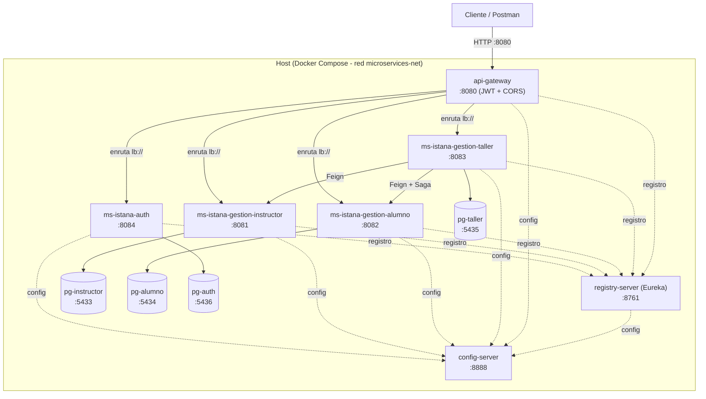

# Diagrama de despliegue

Despliegue containerizado con Docker Compose. Todos los contenedores comparten la red
`microservices-net`. El cliente accede únicamente por el **API Gateway (8080)**.



## Leyenda
- **Flechas continuas**: tráfico de peticiones (HTTP / Feign).
- **Flechas punteadas**: configuración (Config Server) y registro/descubrimiento (Eureka).
- **Cilindros**: bases de datos PostgreSQL (una por microservicio).

## Notas de despliegue
- Solo el **API Gateway (8080)** se expone al exterior; es el único punto de entrada y aplica
  la seguridad (validación JWT + autorización por rol) y CORS.
- Cada microservicio de negocio tiene su **propia base de datos** (patrón *database per service*),
  lo que mantiene el desacoplamiento.
- El **Config Server** debe iniciar primero; el resto reintenta (`restart: on-failure`) hasta
  que esté disponible.
- Dentro de la red de Docker los servicios se resuelven por **nombre de contenedor**
  (override por variables de entorno), no por `localhost`.
- Escalado/balanceo: se pueden levantar múltiples instancias de un microservicio
  (`docker compose up --scale ms-istana-gestion-instructor=2`) y el Gateway/Feign reparten con
  Spring Cloud LoadBalancer.

## Orden de arranque
```
pg-* (bases)  ->  config-server  ->  registry-server  ->  ms-istana-auth / instructor / alumno / taller  ->  api-gateway
```
